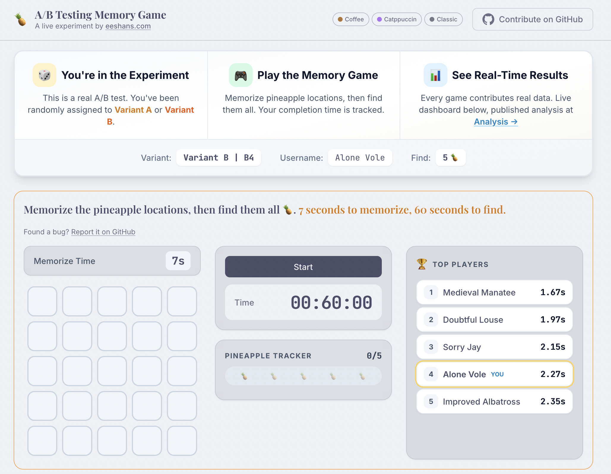
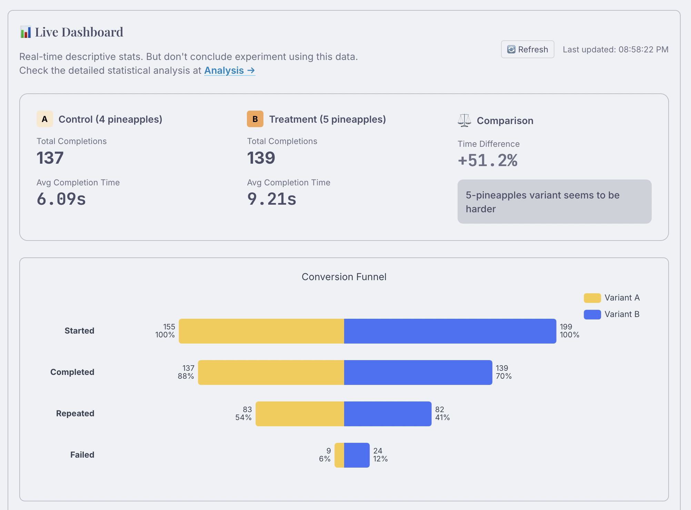
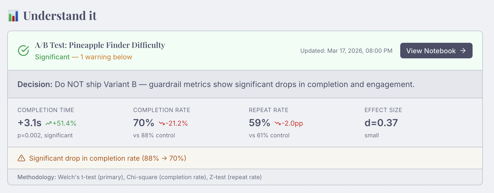

# A/B Testing Memory Game

**A live experiment you can play, contribute to, and learn from.**

Most A/B testing tutorials show you fake data in a notebook. This one is different — it's a real experiment running in production with real users, real statistical analysis, and a real decision at the end.

Play the game at **[absim.eeshans.com](https://absim.eeshans.com)**

---

## The Experiment

You're randomly assigned to one of two variants of a memory game:

- **Variant A** — Find 4 hidden pineapples in a 5x5 grid
- **Variant B** — Find 5 hidden pineapples in the same grid

The question: *does one extra pineapple meaningfully change how people play?*

Every game you play generates real data. The live dashboard shows results updating in real time — completion times, conversion funnels, and a global map of where players are competing from.

## What You Can Learn

**If you're studying experimentation or data science**, this project covers the full lifecycle that most courses skip:

**Designing the experiment** — How to pick a primary metric (completion time), set guardrail metrics (completion rate, repeat rate), and why you need both. What happens when your sample ratio drifts from 50/50 and how to detect it.

**Running it in production** — Feature flags for variant assignment, event instrumentation, and why your tracking layer matters as much as your analysis. The game uses PostHog for feature flags and event capture, with data flowing into Supabase for analysis.

**Analyzing the results** — The full Jupyter notebook runs automatically every 2 hours, querying live data and computing Welch's t-tests, Chi-square tests, effect sizes, and power analysis. You can read the [full analysis](https://absim.eeshans.com/analysis/) on the site.

**Making the decision** — The current result: Variant B is statistically significantly harder (p=0.002, d=0.39), but the real story is in the guardrails. Completion rate dropped from 89% to 69%. The recommendation is don't ship it — not because the primary metric failed, but because the guardrails caught a problem the primary metric alone would have missed.





## Architecture

```
Player's Browser
  → PostHog (feature flags + event tracking)
  → Supabase (leaderboard, dashboard, experiment summary)

GitHub Actions (every 2 hours)
  → Jupyter notebook queries Supabase
  → Runs statistical analysis (scipy, statsmodels)
  → Writes summary back to Supabase

Website (Astro + Tailwind)
  → Reads everything from Supabase client-side
  → Static deploy on Fly.io
```

The notebook is the single source of truth for the analysis. No intermediate files, no build step required to update results. The notebook runs, writes to the database, and the website reads from the database.

## Running Locally

```bash
pnpm install
cp .env.example .env   # add your Supabase + PostHog keys
pnpm dev
```

To run the analysis notebook:

```bash
python -m venv .venv && source .venv/bin/activate
pip install -r analytics/requirements.txt
jupyter execute notebooks/ab_test_analysis.ipynb
```

## Built With

Astro, Tailwind CSS, PostHog, Supabase, ECharts, Leaflet, Python, scipy, statsmodels, Jupyter, Fly.io

---

Built by [Eeshan Srivastava](https://eeshans.com).
